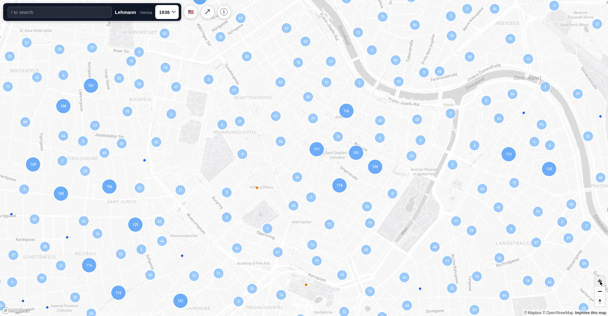
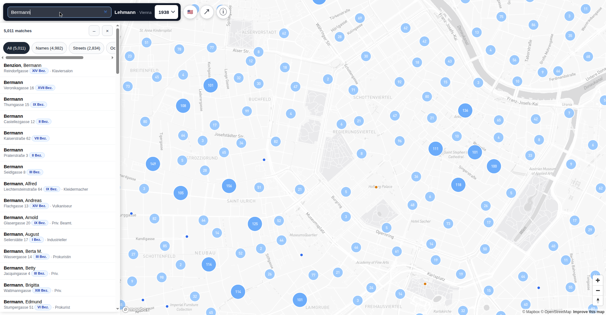
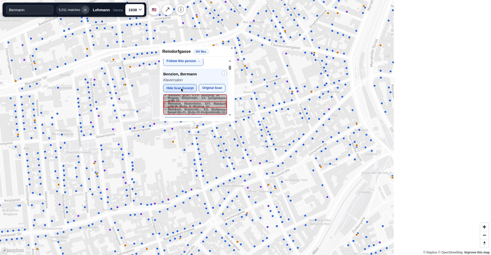
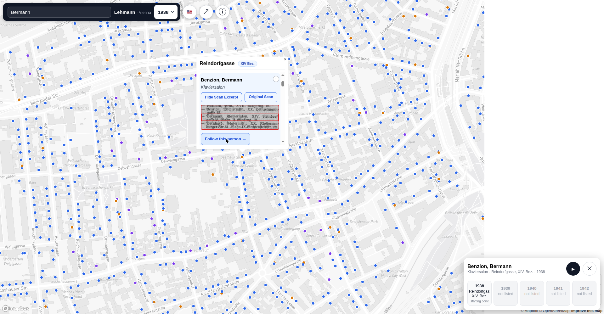

# VienneseDataCrunch

Interactive map of Vienna addresses extracted from *Lehmann's Wohnungsanzeiger*
(Vienna's address books), 1938–1942.

**Live site:** https://mosheberman.github.io/VienneseDataCrunch/

## What it is

Every pin is a Vienna address with one or more people or businesses listed in the
Lehmann directories. The year picker switches between full layers for 1938–1942,
and each record popup shows the scanned row it came from.

- **Search** by surname, street, and occupation, with unit numbers (Stg./Tür/Top)
  where the book lists them
- **Follow this person** — an animated 1938→1942 timeline; the travelling dot
  follows streets (A\* routing over Vienna's street graph), with arrival popups
  per year
- **Scan excerpts** — cropped row images from the original scans, plus a link to
  the full scan page
- **Corrections** — suggest a correction inline on any record; submissions are
  reviewed before they appear on the map
- **Overlays** — Nazi-era street renames traced as lines, and historical sites
  (Sammellager, Aspangbahnhof, Gestapo HQ)
- **Bilingual UI** — English / Deutsch

## Screenshots

| Map | Search |
| --- | ------ |
|  |  |

| Record | Follow this person |
| ------ | ------------------ |
|  |  |

## How it's built

1. Scans of the Lehmann volumes from the Wienbibliothek's Retrodigitalisierung
   copies (public domain)
2. The library's per-page Transkribus ALTO OCR, with bounding boxes for every
   text line
3. Parsing of names, occupations, addresses and unit numbers; headers, footers
   and ads stripped
4. Street-name normalization — ambiguous forms held for review, not silently fixed
5. Geocoding against the City of Vienna address registry
6. Tiered pins: blue exact match, purple registry match, amber fuzzy-approximate

Caveats: OCR misreads names; some streets were renamed or no longer exist; amber
pins are approximate. A missing pin doesn't mean the entry is missing from the
book — not every address matched the modern registry.

## Repository layout

- `index.html` — the site (single-file app)
- `data/`, `data39/`, `data40/`, `data41/`, `data42/`, … — per-year record shards
- `layers/` — GeoJSON overlays (street renames, historical sites, street graph)
- `research/` — draft explorers and experiments (unreviewed work in progress)
- `pipeline/` — build scripts

## Licensing

- **Scans:** Wienbibliothek im Rathaus —
  [Public Domain Mark 1.0](https://creativecommons.org/publicdomain/mark/1.0/).
  When reusing the scans, please credit the Wienbibliothek im Rathaus as the
  holding institution.
- **Extracted map data:** [CC0 1.0 Universal](https://creativecommons.org/publicdomain/zero/1.0/).

## Releases

Changes ship as tagged [semantic-versioned releases](../../releases)
(`vMAJOR.MINOR.PATCH`):

- **PATCH** — bug fixes, small corrections
- **MINOR** — new features, new overlays, new data layers
- **MAJOR** — breaking changes to data formats or URLs

The running site's version is shown in Settings → About → Licensing.
